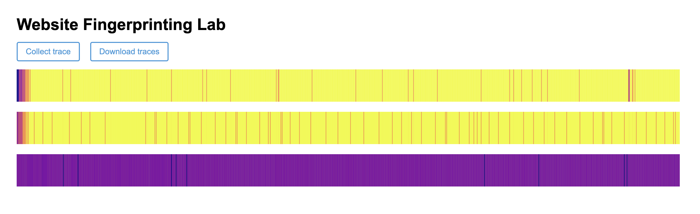

## Optional

**Report your browser version, CPU type, cache size, RAM amount, and OS. We use this information to learn about the attack’s behavior on different machines.**

- Browser: Chrome
- CPU: Apple M1
- Cache sizes: 128 KB
- RAM: 8GB
- OS: macOS Ventura 13.6.3

## 1-2

**Use the values printed on the webpage to find the median access time and report your results as follows.**

| Number of Cache Lines | Median Access Latency (ms) |
| --------------------- | -------------------------- |
| 1                     | 0                          |
| 10                    | 0                          |
| 100                   | 0                          |
| 1,000                 | 0                          |
| 10,000                | 0.19999992847442627        |
| 100,000               | 0.7000000476837158         |
| 1,000,000             | 1.6999999284744263         |
| 10,000,000            | no output                  |


## 1-3

**According to your measurement results, what is the resolution of your `performance.now()`? In order to measure differences in time with `performance.now()``, approximately how many cache accesses need to be performed?**

0.1ms, 5000 cache accesses


## 2-2

**Report important parameters used in your attack. For each sweep operation, you access N addresses, and you count the number of sweep operations within a time interval P ms. What values of N and P do you use? How do you choose N? Why do not you choose P to be larger or smaller?**

512K, 10


## 2-3

**Take screenshots of the three traces generated by your attack code and include them in the lab report.**




## 2-4

**Use the Python code we provided in Part 2.1 to analyze simple statistics (mean, median, etc.) on the traces from google.com and nytimes.com. Report the statistic numbers.**

Website: https://www.google.com, Mean: 7.7765, Median: 8.0
Website: https://www.nytimes.com, Mean: 7.1795, Median: 7.0

## 2-6

**Include your classification results in your report.**

```
                          precision    recall  f1-score   support

   https://www.baidu.com       0.98      0.98      0.98        42
https://www.facebook.com       0.92      0.76      0.83        45
  https://www.google.com       0.74      0.91      0.82        34
 https://www.youtube.com       1.00      1.00      1.00        39

                accuracy                           0.91       160
               macro avg       0.91      0.91      0.91       160
            weighted avg       0.92      0.91      0.91       160
```

## 3-2

**Include your new accuracy results for the modified attack code in your report.**

```
                          precision    recall  f1-score   support

   https://www.baidu.com       0.92      1.00      0.96        33
https://www.facebook.com       0.95      1.00      0.98        40
  https://www.google.com       1.00      0.92      0.96        49
 https://www.youtube.com       1.00      0.97      0.99        38

                accuracy                           0.97       160
               macro avg       0.97      0.97      0.97       160
            weighted avg       0.97      0.97      0.97       160
```

## 3-3

**Compare your accuracy numbers between Part 2 and 3. Does the accuracy decrease in Part 3? Do you think that our “cache-occupancy” attack actually exploits a cache side channel? If not, take a guess as to possible root causes of the modified attack.**

